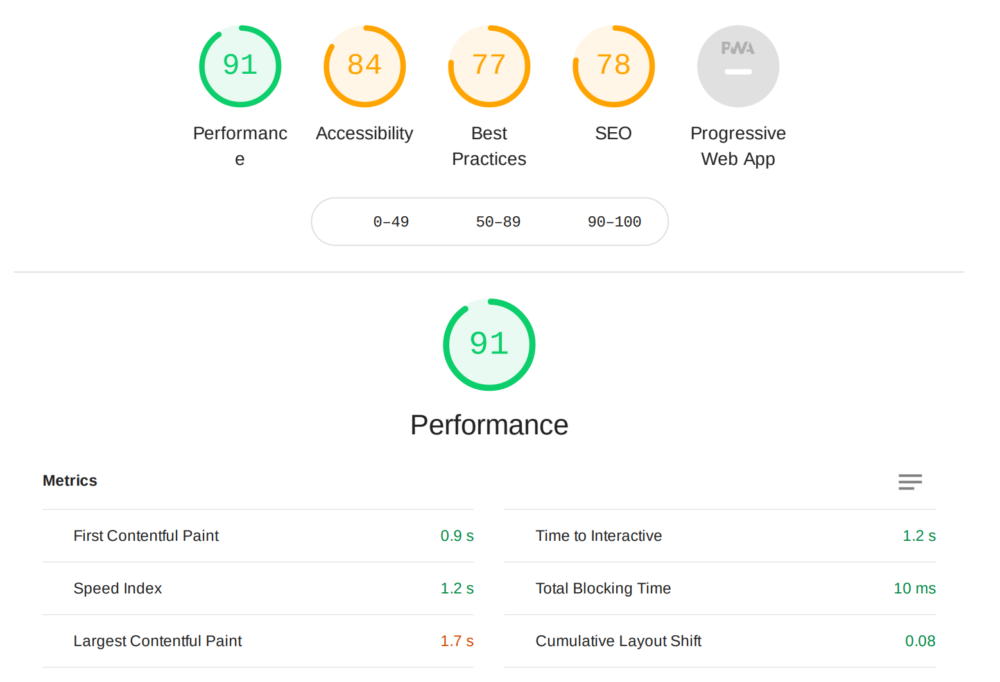

# Guatemalan Coffees shop

Welcome!

The development of this web application was carried out as my Fourth Milestone Project for the Full-Stack Web Development Diploma from the Code Institute.

This appliction's code was written on my own using the Django Full-Stack Framework, Python, HTML5, CSS3 and JavaScript to demonstrate my personal skills and acquired knowledge from this online program. Some other libraries which are listed later on were used as well to simplify functions and styling.

The application is deployed and available in Heroku and can be accessed here:

[Guatemalan Coffees Shop](https://guatemalan-coffees-shop.herokuapp.com/)

Feel free to use it and reach out for any comments or suggestions that you may have.

**Important!** The Stripe test API is activated for this deployed app. Thus you can use the credit card number 4242-4242-4242-4242 with any expiry date in the future and any CCV to check out and cretae a fictional order.

## UX

The main objective was to create an eCommerce Web application using the Django Full Stack-Framework and a relational database to create an interactive website. The application was developed for a **fictional online commerce store** selling coffee products from Guatemala to users all over the world. Users are able to browse through the store's different products and are exposed to their specific regional facts so they can become more familiar with the country Guatemala and even engaged in supporting the different Guatemalan coffee regions by purcashing the products.

**DISCLAIMER** The online store from this application is completely fictional and all the products displayed in this eCommerce store were taken from other online shops with similar scopes. The purpose of creating this store is merely for academic reasons and to demonstrate my own personal software development skills.

This application's backend allows users to store and manipulate data records on the domain. The project itself was developed using multiple apps in Django, where each app contains a potentially reusable component in the project.

The importance for this web application was identified through some User Stories like the following:
1. "I am an expert coffee consumer and oftenly find myself trying new coffee products from different countries. I prefer to buy my coffee online because it is the only way I can get them more directly from coffee producers, without the commercial chain stores in-between that only sell low quality coffees."
2. "I enjoy buying coffee online. To me quality and freshness are the main criteria for buying coffee. I go for those using rare coffee beans from one specific region or plantation with natural fruity cupping tones. Supermarkets nowadays only sell predesigned industrial blends that are even artificially flavored. That is why I prefer to buy them from smaller shops online that do not use artifical flavors."
3. "Whenever I buy coffee, I prefer having the choice to chose the grind size myself and not someone else deciding it for me. It all depends on which coffee method I want to use: Espresso, French-press, Aeropress, etc. And whenever I want to store the coffee for a while at home, I prefer of course the whole bean presentation."
4. "Sometimes I have heared Guatemala is a quality coffee producing country. I personally do not know much about the country and would be interested to find out how the coffee is produced there: I would like to see some pictures of the plantations, see local people and get to know some regional facts about where my coffee is really coming from. Sometimes people ignore what's behind the coffee that they are drinking but I believe every coffee has its own history and regional character. That's what I want to learn before I buy my coffee!"
5. "Online stores websites should be straightforward and easy to use. It is very convenient being able to create an account in order to save my delivery address so I do not have to enter the same information over and over again."
6. "Sometimes I find it difficult to select one product among different options. However, it becomes easy by reading some reviews of previous shoppers. It is much easier to make a choice when you can learn from other users' good or bad experiences. Reviews should always be available in any online store."

### Wireframe hosted in LucidChart

The user experience design of this application was first conceived using wireframes on LucidChart. The file is available for visualization under this following URL: 
- [LucidChart Wireframe](https://app.lucidchart.com/invitations/accept/0df8e03c-b9e6-4dc7-b94e-ecc86fe35869)

This is an image of the wireframe that can be accessed with the URL above.

As observed on the wireframe, the concept of creating a base template with header and footer was considered and the extra content in the middle would be producced in different templates in Django. All sections were developed with some minor variations except for the 'Coffee Clubs' section. This remains as undeveloped because it would require many other views, models, templates and Stripe methods that are not necessary for the purpose of submission of this Milestone Project.

### Database ER Diagram

The design of the database was carried out using an Entity Relationship Diagram (ERD). The relationships between the main entities are shown in the following diagram.

Only the main models around this application are displayed in the diagram. Secondary models are the customer inquiry and product image models that were not included directly on the diagram in order to keep a more clear visualization.

## Features
 
This application's backend allows users to store and manipulate data records on the domain. The project itself was developed using multiple apps in Django, where each app contains a potentially reusable component in the project. These are the following features already developed and implemented on this application:
 
### Existing Features
- User Authentication: Users are able to create new accounts with their personal information in order to save their data for future orders, create product reviews or send inquiries to the store.
- Google Account Registration: Users can register to the application using their personal Google accounts to create a more convenient experience. No need to enter name, last name, email address because the data is colelcted directly from the user's Google account.
- Administrator User Features: Some extra features are available only to administrator users like creating new products for the store, edit them or delete them, without having to enter the Django Administration interface.
    - Adding new products: New products can be succesfully added to the store by using the special page. However, only a main image can be added at this point. Additional images to products still have to be added through the Django Administration interface.
- Product Filters: The All Products section has some useful features to filter products by origin region, order them by price, rating or to view only those products featured as 'NEW'. These filters can be activated on the filter panel using the checkboxes or simply selecting the desired region.
- Customer Inquiry: Using the 'Contact' button accessible on every page, registered and non-registered users can send inquiries to the store by filling a short form. When the form is submitted, an email confirmation is sent to the user's email address. When users are registered, the contact information is pre-filled automatically with their contact information.
- Shopping cart: 
    - Users can add items to their shopping cart while browing through the store's products. Data is stored safely in the browser's session data so it remains even if the user closes the browser.
    - The total of the shopping cart is always displayed on top of the page next to the cart icon to remind users how much would be spent.
    - Users can edit or remove items from their cart before moving on to the checkout page.
- Checking-Out: Before doing any payment, users are requested to fill out the checkout form to include the contact information, shipping address and billing information. Registered users have the extra feature to 'Save Info' to their account so they don't need to enter it every time they want to check out.
- Profile Page: Registered users can manually save or edit their profile information for future orders, they can browse through their purchase history and check how many product reviews they have written.
    - Purchase history: On the right side of the page, users can select a previous order and see all the information stored from that order: billing information, delivery address, etc.
    - Profile information: Users are able to edit their own profile information any time on the form and using the 'UPDATE' button to save it.
- Product Reviews: Registered users can additionally rate products using a star rating system (from 1 to 5) and leave a product review about their own personal experince consuming one product. Other users can read those comments and check how the product has been previously rated with the star-rating system.
- Toasts Messagess: After a successful or unsuccessful action, users are notified accordingly with toast messages that temporarily appear on top or botton of the page without any intrusiveness to confirm or alert the user that an action has been caried out, e.g. order has been succesfully placed.
- Product Multiple Images: Products can have additional images to include visual content about the region they are produced in. This was achieved using an additional model called 'ProductImage' which contains a single image file. Products can contain more than one of these models and all the images are displayed on their respective page.
- Search Bar: Products can be searched by using the search icon on top of the page. A search bar shows up and users can enter a related term to query through the different products available. The search term is matched on the backend with any product name, description or region name and the corresponding results are returned on the products page.
- Webhook Handler for payments: In case an impatient user closes the window or by mistake clicks on the 'back' button while processing an order payment. The webhook handler coming from Stripe deals with this case and looks for that order information in the database that was produced from the payment and in case it does not exist, it creates a new order and confirms the user by sending an email confirmation.

### Features Left to Implement

In addition, these are the plans for additional features to be implemented in the future:

- Multiple images upload: Authorized users having access to the Product Management pages will be able to upload multiple images at the same while creating one new product in the store. The additional images would be added as instances of the 'ProductImage' model.
- Cancelling orders: In case the user decides to cancel an order, instead of filling a customer inquiry form to contact the store. Users will have the ability to cancel an existing order within a certain time frame after they placed it.
- Account Management Tools: Different tools that have not been fully activated yet will be added like 'Reset Password' button, 'Change Password' button, 'Delete my account' option, etc.
- Picture reviews: The Product Review model will be expanded to accept images so that users can also upload images to their reviews.
- Avatar pictures: Users will be able to personalize their profile by selecting avatar images or include their own profile picture from their Google account as an avatar that would be displayed when adding a product review.

## Technologies Used

Languages, frameworks, libraries, and other tools used to construct this project.

- HTML5
    - Language used for the different templates structure on front-end.
- Python
    - Language used for the Django framework structure, as well as the different libraries and dependencies used.
- CSS3
    - Language used for providing styles to html elements, including some overridings on MaterializeCSS.
- JavaScript
    - Language used for enhancing the users frontend experience, some form validation and form submissions.
- [Django Framework](https://www.djangoproject.com/)
    - Python-based free and open-source web framework used to building this application following the model-template-views architectural pattern.
- [jQuery](https://jquery.com/)
    - jQuery code was used to simplify HTML DOM tree traversal and manipulation, as well as event handling and CSS animation.
- [Materialize CSS](https://materializecss.com/)
    - The project uses **Materialize** to simplify giving styles and adding JavaScripts to different elements. Also it is found in the navbar construct, display cards, grid-layout, as well as other Javascript driven elements like modals, toasts, forms, etc to complement the application.
- [GitPod](https://www.gitpod.io/)
    - Online IDE for GitHub to develop code of this project.
- [GitHub](https://github.com/bramrodrigo89/)
    - Used to manage the version control of the code for this project.
- [Heroku](https://fontawesome.com/icons?d=gallery)
    - Cloud platform to deploy this application on the internet.
- [SQLite](https://www.sqlite.org/index.html)
    - The project uses this relational database to store and manage the data behind the application in development mode.
- [PostgreSQL](https://www.postgresql.org/)
    - The project uses this relational database to store and manage the data behind the application in production mode connected to the Heroku environment.
- [Stripe Payments API](https://stripe.com/)
    - This application relies on Stripe payments to process credit cards and uses Stripe webhooks to create orders and verify their creation when payments are processed. Test API is currently activated for this deployment.
- [Amazon AWS Free Tier](https://aws.amazon.com/?nc2=h_lg)
    - Storing static javascript and css files in the cloud, as well as all media images using a 'Storage Bucket'.
- [Google Material Design Icons](https://material.io/resources/icons/?style=baseline)
    - Imported different icons for different action buttons, links and items.
- [Google Font Library](https://fonts.google.com/)
    - Imported 'Ubuntu Condensed' font family with 500 weight for the complete application content.
- [Unsplash Images](https://unsplash.com/)
    - Freely-usable images. Background images were downloaded from this source.
- [Animockup](https://animockup.com/)
    - Free animated mockup maker to create custom GIFs for this ReadMe file.
- [Codacy: Automated code reviews & code analytics](https://www.codacy.com/)
    - Automated code quality tools and static analyzers to ensure that this code maintains high quality.

## Testing

### Testing User Stories

User stories previously medioned are addressed in the following points:

1. **"I prefer fresh products coming from one single origin region instead of industrial blends"**
    - Products were categorized in regions for this application, where each products belongs to a single coffee growing region. The same product cannot be added to more than one region thanks to the database one-to-one relationship. Products can as well be filtered by region and each region contain its own regional data that is displayed on the product's description page.
2. **"Whenever I buy coffee, I prefer having the choice to chose the grind size myself and not someone else deciding it for me."**
    - Users have to decide for a grind size before adding a product to their shopping cart. This information is saved throughout the checking-out process and finally in the order saved in the database as part of the 'Order Inline Items' instances.
3. **"I would like to see some pictures of the plantations, see local people and get to know some regional facts about where my coffee is really coming from."**
    - The Product model has been complemented with an 'Product Image' model that stores different images for a single product which can be used to save images from the coffee plantations and their process. There is no limit of how many images can be added but a maximum of 4 is suggested.
4. **"It is very convenient being able to create an account in order to save my delivery address so I do not have to enter the same information over and over again."**
    - After users have registered and created an account, they can opt to save their information from their last order by checking the box 'Save my info' and the data will be stored in their profile, which will be retrieved automatically when checking out.
5. **"Reviews should always be available in any online store."**
    - Products can be reviewed by registered users, who can leave a rating using the stars and including an extra comment with the provided form. Other users will be able to see that information when browsing through that same product's page.

### Problem Solving

During the development phase some bugs have been encountered which had to be solved:

1. **Problem**: Google Authentication API was producing unwanted errors when trying to create a new user while being on development environment. Continous error: 'Local host refused to connect'.
    - **Solution**: Project was deployed to Heroku and Google Auth API credentials were saved in Postgres database. When tried again in production, Google API started to function properly.
2. **Problem**: Some special dependencies for adding a phone number field to a model do not work together very well with the Materializecss dependency to render forms, producing a non-user-friendly enter field for adding a phone number.
    - **Solution**: Changed the phone number field in Order and ProfileInfo back to a usual Charfield. Solution is being rendered correctly with MaterializeCSS but there is not a specific data validation for phone number entry.
3. **Problem**: Webhook handler creating a duplicate order because the order was not found in the dabase despite having the same information coming from the Stripe webhook. 
    - **Solution**: Problem was caused by the different data types coming from the webhook handler: some were integers, some were strings. Removed the SQL 'iexact' lookup for some fields and the webhook handler started to find the respective orders correctly.
4. **Problem**: 'User Rating' model coming from the django-stars-rating dependency could not be extended to add additional text fields, like description, product ID, or date of review. 
    - **Solution**: Created one independent own model to add user reviews and the star rating number is transfered to own model when saving in the datase. With this approach it is possible for users to simly give a star rating the stars without adding a text review of the product.
5. **Problem**: Customer Inquiry Form was accessible only from the index.html home page because the model and the views to handle the forms are bound to the 'home' app.
    - **Solution**: Transfered the customer_inquiry_form function to contexts.py and made this function available througout the app using context processors in settings.py.

Bugs that remain unsolved:

1. **Problem**: When two or more items of the same product ID but different grind size have been added to the cart, the '+' (plus) and '-' (minus) symbols to add or substract quantities does not work properly because there are two items of the same ID, so the Javascript logic needs to be changed to include grind size in the DOM manipulation.
2. **Problem**: Additional images cannot be added when creating a new product in the Product Management feature. Only the main image is being uploaded but not the additional images. Python logic needs to be corrected to accept new images and save them as instances of the 'ProductImage' model.
3. **Problem**: Option to 'feature as new' product when adding product is always activated. When checkbox is not selected, the produt is still featured as new product. Thus the checkbox functionality needs to be corrected.
4. **Problem**: Search terms are in some cases not functioning well for the region names. It is best to activate the region filters from the left panel because the search bar does not provide accurate results when a region name is entered.

### Manual Testing

These are scenarios whose testings have not been automated, thus it is necessary to test the user stories manually:

1. Placing New Orders:
    1. Add different products to shopping cart.
    2. Verify that total and subtotal are correctly displayed every time items are added or removed from shopping cart.
    3. Start filling out check-out form with invalid information and check that fields are not accepted and form cannot be submitted. Toast message should be displayed 'Please verify your information'.
    4. Try to submit the form with all valid inputs and verify that a toast success message appears when order confirmation page is displayed.
    5. Check that email confirmation was submitted to the user's email address with the subject: 'Order Confirmation, Order # ...'.
    6. Verify in the database that order has been created and saved properly.

2. Customer Inquiry form:
    1. Go to the "Contact Us" page
    2. Try to submit the empty form and verify that an error message about the required fields appears
    3. Try to submit the form with an invalid email address and verify that a relevant error message appears
    4. Try to submit the form with all inputs valid and verify that a toast success message appears.
    5. Check that email confirmation was submitted to entered address with the subject: 'Thank you for contacting us!'.

3. Adding New Products to store:
    1. As a authorized user with management rights, verify that you can see 'Product Management' under the 'Account' menu options.
    2. Start adding a new product. Verify that filling out the form with invalid inputs would cause an error toast message 'Please verify that inputs are valid', for example in this situations:
        1. Entering a negative price lower than US$ 0.01
        2. Entering a price including more than 5 digits.
        3. Submitting the form without one of the required fields (marked with the * symbol).
    3. When filling out form correctly, product should be added to database and success toast message should be displayed 'Product added succesfully'.
    4. If desired the 'delete' option can be tested too to verify that products can also be removed from database.
    5. After deleting product, it should not appear anymore in the 'all products' section.

### Performance

A LightHouse Report was generated to evaluate the performance of the web application. The full report can be retrieved here: [Light House Report](documentation/Lighthouse_Complete_Report.pdf)
In order to run this test it is necessary to open the application on incognito mode of Chrome browser and follow these steps:
1. Activate Developer Tools by doing right click and select "Inspect"
2. Click on "Console" from the upper menu items and then click on the two arrows in the end of the list to the right >>
3. Select "Lighthouse" and then "Generate Report"
4. Follow the prompt to finalize report. Use the options to print report if necessary. 

### validation

In order to ensure this code meets the various standards, CODACY was used which automatically validates each commit made for this repository and analyzes possible issues in every file. The overall result of this stastical analysis is observed in the Codacy Badge, where 'A' represents the highest score and 'F' the lowest one.

Besides that, Flake8 was used to analyze format issues during development to avoid accumulating several issues to solve in the end. This is available however only for Python files.

## Deployment

The project is stored on an external repository on [GitHub](https://github.com/bramrodrigo89/guate-coffees-shop) and deployed on Heroku:
[Guatemalan Coffees Shop](https://guatemalan-coffees-shop.herokuapp.com/)

To clone this repository the following steps need to be taken:

1. Clone this repository to your own repositories with the given clone option.
2. Create a virtual development environment that best suits your system. I used GitPod because I use ChromeOS.
3. Makes sure you have have Python 3.7 installed or a higher version.
4. In order to install all of the dependencies required to run the project, you can do this giving the command `pip3 install -r requirements.txt`. This should install all of the packages listed in the file recursively.
5. Add the following 5 variables to your work environment:
    1. DEVELOPMENT = True
    2. SECRET_KEY = (edited) Django Secret Key
    3. STRIPE_PUBLIC_KEY = (edited) Stripe Public Key **Use from own Stripe account**
    4. STRIPE_SECRET_KEY = (edited) Stripe Secret Key **Use from own Stripe account**
    5. STRIPE_WH_SECRET = (edited) Stripe Webhook Secret Key **Use from own Stripe account**
6. Use the command `python3 manage,py runserver` to get the project running on your localhost.
7. You will need to change the email settings in settings.py to get the project to send order confirmations via your own email services.

To deploy the project from your own repository to Heroku, the following steps should be taken:

1. Log in to Heroku and select 'New' to create a new app. 
2. Depending on your location, a specific region should be chosen. On this case, United States was selected. Give a unique name to the application of your choice. Then proceed to click on 'Create App'.
3. Once the app is created, go to Settings to start adding the environmental variables. Go to 'Config Vars' and click on Reveal. 
4. Start adding the configuration variables in Key, Value pairs. In this case, 10 variables are necessary:
    1. AWS_ACCESS_KEY_ID = (edited) **Add your own AWS bucket storage credentials**
    2. AWS_SECRET_ACCESS_KEY = (edited) **Add your own AWS bucket storage credentials**
    3. DATABASE_URL = (edited) **Used to access Postgres Database**
    4. EMAIL_HOST_PASS = (edited) **Example: Gmail API Pass, use your own**
    5. EMAIL_HOST_USER= Email address, e.g. your_name@gmail.com
    6. SECRET_KEY = (edited) Django Secret Key
    7. STRIPE_PUBLIC_KEY = (edited) Stripe Public Key **Use from own Stripe account**
    8. STRIPE_SECRET_KEY = (edited) Stripe Secret Key **Use from own Stripe account**
    9. STRIPE_WH_SECRET = (edited) Stripe Webhook Secret Key **Use from own Stripe account**
    10. USE_AWS = True
5. Once the environment is set up, go to the 'Deploy' Tab and select 'GitHub' as deploment method. 
6. Now select this repository (bramrodrigo89/guate-coffees-shop) as the main source to connect to. 
7. Select 'Enable Automatic Deploys' on the following section from the 'master' branch. 
8. Now before the first automatic deploy, a requirements.txt file should be added to the project. It can be added by using the pip3 command: ``pip3 freeze --local ->requirements.txt`` This will indicate which are the necessary dependencies to install before the application is run. 
9. Next make sure that a Procfile is created. Simply add a new file on your main directory as 'Procfile' which should contain the command:  ``web: gunicorn guate_coffee_shop.wsgi:application`` This will tell Heroku to initiate weby dynos with the main appplication of this project called guate_coffee_shop.
10. Now it is possible to push the project to GitHub and it will automatically transfer it to Heroku for deployment.
11. Wait for the status 'Build succeeded' in Heroku 'Latest Activity' Section (around 5 minutes). Once the deploment is confirmed, go to 'Open App' to confirm the deployment. The URL can be shared now to access the application. 
12. In case there is an error and the app cannot open, go to View Logs to check the error messages. 

## Credits

### Content
- Information from different coffee regions in Guatemala, weather and geographical data were taken from [The Guide To Guatemalan Coffee: Brewing And Buying Tips](https://www.homegrounds.co/guatemalan-coffee/) in HomeGrounds.com.
- Product descriptions were taken from their respective coffee dealers' websites.

### Media
- Background images used in parallax sections were taken from Unsplash.
- Guatemalan Coffes logo shown below was taken from the Guatemalan Coffee Association online store, which is referenced also in the Footer as an 'External Link' called 'Guatemalan Coffees'.

- Product images from all products were taken from actual commercial products available. The aim of this application is merely for showing a sample of personal development skills and it is not an intention to do any type of advertising for any of these produts displayed here.

### Acknowledgements

- I received inspiration for this project from my family. 
- Special thanks to my mentor from Code Institute for the direction I needed:
    - Anthony Ngene @tonymontaro_mentor
- And last but not least, many thanks to the Slack Community and Tutor Team from Code Institute for coming with great solutions whenever I needed help. 
