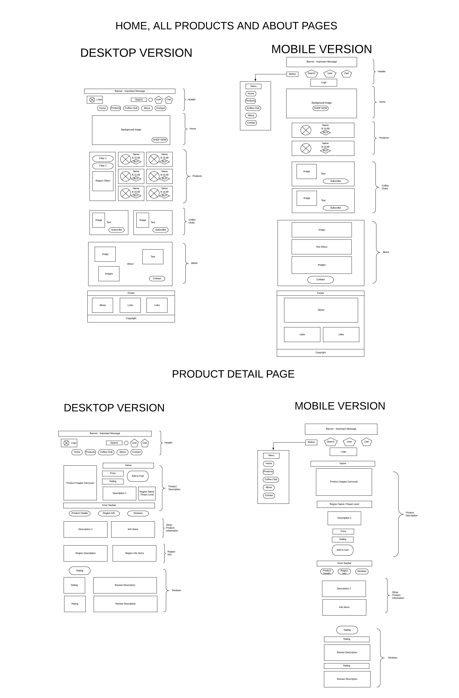
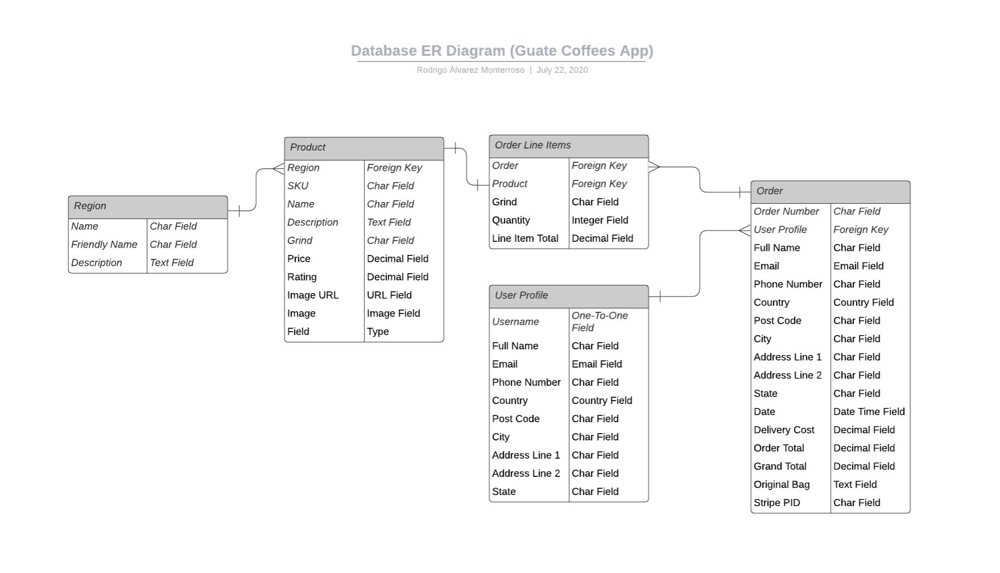

# Guatemalan Coffees shop

Welcome!

The development of this web application was carried out as my Fourth Milestone Project for the Full-Stack Web Development Diploma from the Code Institute.  

This appliction's code was written on my own using the Django Full-Stack Framework, Python, HTML5, CSS3 and JavaScript to demonstrate my personal skills and acquired knowledge from this online program. Some other libraries which are listed later on were used as well to simplify functions and styling. 

The application is deployed and available in Heroku and can be accessed here:

[Guatemalan Coffees Shop](https://guatemalan-coffees-shop.herokuapp.com/)

Feel free to use it and reach out for any comments or suggestions that you may have.

**Important!** The Stripe test API is activated for this deployed app. Thus you can use the credit card number 4242-4242-4242-4242 with any expiry date in the future and any CCV to check out and cretae a fictional order. 

## UX

The main objective was to create an eCommerce Web application using the Django Full Stack-Framework and a relational database to create an interactive website. The application was developed for a **fictional online commerce store** selling coffee products from Guatemala to users all over the world. Users are able to browse through the store's different products and are exposed to their specific regional facts so they can become more familiar with the country Guatemala and even engaged in supporting the different Guatemalan coffee regions by purcashing the products.

**DISCLAIMER** The online store from this application is completely fictional and all the products displayed in this eCommerce store were taken from other online shops with similar scopes. The purpose of creating this store is merely for academic reasons and to demonstrate my own personal software development skills. 

This application's backend allows users to store and manipulate data records on the domain. The project itself was developed using multiple apps in Django, where each app contains a potentially reusable component in the project.

This importance for this web application was identified through some User Stories like the following:
- I am an expert coffee consumer and find myself usually tring to taste new products from different countries. I prefer to buy my coffee products online because it is the only way I can get them more directly from coffee producers, without large chain stores in between. 

This section is also where you would share links to any wireframes, mockups, diagrams etc. that you created as part of the design process. These files should themselves either be included as a pdf file in the project itself (in an separate directory), or just hosted elsewhere online and can be in any format that is viewable inside the browser.

## Features

In this section, you should go over the different parts of your project, and describe each in a sentence or so.
 
### Existing Features
- Feature 1 - allows users X to achieve Y, by having them fill out Z
- ...

For some/all of your features, you may choose to reference the specific project files that implement them, although this is entirely optional.

In addition, you may also use this section to discuss plans for additional features to be implemented in the future:

### Features Left to Implement
- Another feature idea

## Technologies Used

In this section, you should mention all of the languages, frameworks, libraries, and any other tools that you have used to construct this project. For each, provide its name, a link to its official site and a short sentence of why it was used.

- [JQuery](https://jquery.com)
    - The project uses **JQuery** to simplify DOM manipulation.
- [Animockup](https://animockup.com/)
    - Free animated mockup maker to create custom GIFs for this RedMe file.

## Testing

In this section, you need to convince the assessor that you have conducted enough testing to legitimately believe that the site works well. Essentially, in this part you will want to go over all of your user stories from the UX section and ensure that they all work as intended, with the project providing an easy and straightforward way for the users to achieve their goals.

Whenever it is feasible, prefer to automate your tests, and if you've done so, provide a brief explanation of your approach, link to the test file(s) and explain how to run them.

For any scenarios that have not been automated, test the user stories manually and provide as much detail as is relevant. A particularly useful form for describing your testing process is via scenarios, such as:

1. Contact form:
    1. Go to the "Contact Us" page
    2. Try to submit the empty form and verify that an error message about the required fields appears
    3. Try to submit the form with an invalid email address and verify that a relevant error message appears
    4. Try to submit the form with all inputs valid and verify that a success message appears.

In addition, you should mention in this section how your project looks and works on different browsers and screen sizes.

You should also mention in this section any interesting bugs or problems you discovered during your testing, even if you haven't addressed them yet.

If this section grows too long, you may want to split it off into a separate file and link to it from here.

## Deployment

This section should describe the process you went through to deploy the project to a hosting platform (e.g. GitHub Pages or Heroku).

In particular, you should provide all details of the differences between the deployed version and the development version, if any, including:
- Different values for environment variables (Heroku Config Vars)?
- Different configuration files?
- Separate git branch?

In addition, if it is not obvious, you should also describe how to run your code locally.

## Credits

### Content
- The text for section Y was copied from the [Wikipedia article Z](https://en.wikipedia.org/wiki/Z)

### Media
- The photos used in this site were obtained from ...

### Acknowledgements

- I received inspiration for this project from X

## Wireframe 

## Database ER Diagram

